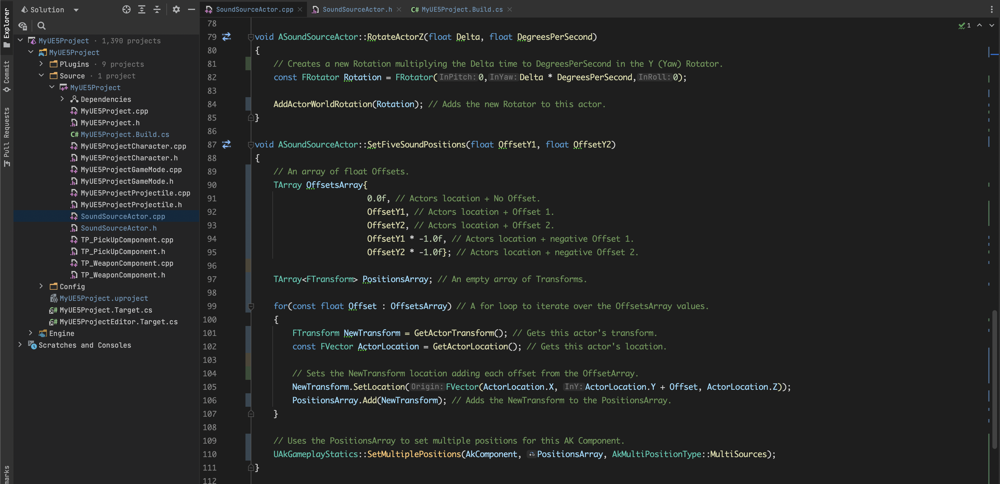
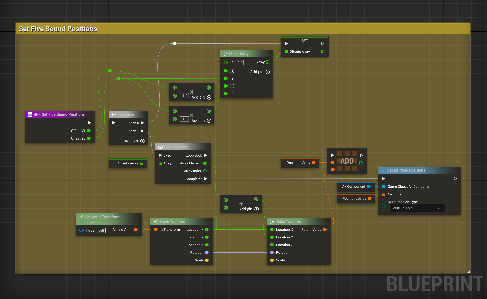

# Spatialization #1 in Unreal Engine 5 and Wwise
### Game Audio Blog - Above Noise Studios
English: [https://abovenoisestudios.com/blogeng/wwiseue5spatialization1eng](https://abovenoisestudios.com/blogeng/wwiseue5spatialization1eng)\
Spanish: [https://abovenoisestudios.com/blogespanol/wwiseue5spatialization1esp](https://abovenoisestudios.com/blogespanol/wwiseue5spatialization1esp)\
\
Created By: Horacio Valdivieso\
[horacio@abovenoisestudios.com](mailto:horacio@abovenoisestudios.com)\
[LinkedIn](https://www.linkedin.com/in/horaciovaldivieso/)

---
_Unreal Engine Version: **5.0.3**_\
_Wwise Version: **2021.1.10.7883**_
### **English:**
This repository contains an Unreal Engine 5 project, and a Wwise project.
It uses a first-person template created with the Epic Games Launcher.
This project aims to show four audio spatialization techniques in Wwise, and how to program them using Blueprints and C++.

**How to Use?:**\
To download this project, click on the **Code** button and **Download Zip**.\
**The Wwise - Unreal plugin integration is too big for this repository file size limit.**
Please click on this [LINK](https://drive.google.com/drive/folders/1ML9JwAD7PLmv4E-suevWdLr2XJtf5TJ3?usp=sharing) to download the Wwise plugin integration, then unzip and paste the "Wwise" folder inside the "Plugins" folder.

To rebuild and compile the project, ensure you have [Visual Studio](https://visualstudio.microsoft.com/) for Windows or [Xcode](https://download.developer.apple.com/Developer_Tools/Xcode_13.4.1/Xcode_13.4.1.xip) for Mac.
Right-click on **MyUE5Project.uproject** and choose **"Generate Visual Studio Project Files"** on Windows or **Services > "Generate Xcode project"** on Mac.
Double-click on **MyUE5Project.uproject** to open the UE5 project.

**Rebuild the project:**

The Wwise project is inside the **MyUE5_Wwise_Project** folder.

**IMPORTANT:** If you can't hear any sound, go to **Build > Generate Sound Data** and choose your platform.

**About Compiler Versions:**

WINDOWS:

- _Visual Studio 2019 v16.11.5 to 2022 are currently compatible with UE5_.
- _Its essential to install these Workloads: **".NET Desktop Development"**, **"Desktop Development With C++"**, and **"Game Development With C++"**._\
  **Here is a useful video on how to set up VS for UE5 Development:** [LINK](https://youtu.be/8xJRr6Yr_LU?t=105)

MAC:
- _Xcode v12.4 to 13.4.1 are currently compatible with UE5_.

Enjoy!

### **Spanish:**
Este repositorio contiene un proyecto en Unreal Engine 5, y un proyecto Wwise.
Usa una maqueta en primera persona creada con el Epic Games Launcher.
Este proyecto pretende mostrar cuatro técnicas de espacialización de audio en Wwise, y cómo programarlas usando Blueprints y C++.

**Cómo Usar?:**\
Para descargar este proyecto, da click en el botón **Code** y luego en **Download Zip**.
**El plugin de integración Wwise - Unreal es muy grande para los límites de tamaño de este repositorio.**
Da click en este [LINK](https://drive.google.com/drive/folders/1ML9JwAD7PLmv4E-suevWdLr2XJtf5TJ3?usp=sharing) para descargar el plugin de integración de Wwise, luego descomprime y pega la carpeta "Wwise" dentro de la carpeta "Plugins".

Para construir y compilar el proyecto, asegúrate de tener [Visual Studio](https://visualstudio.microsoft.com/) para Windows o [Xcode](https://download.developer.apple.com/Developer_Tools/Xcode_13.4.1/Xcode_13.4.1.xip).
Haz click derecho en **MyUE5Project.uproject** y selecciona **"Generate Visual Studio Project Files"** en Windows o **Services > "Generate Xcode project"** en Mac.
Haz doble click en **MyUE5Project.uproject** para abrir el proyecto UE5.

**Reconstruye el proyecto:**

El proyecto Wwise se encuentra en la carpeta **MyUE5_Wwise_Project**.

**IMPORTANTE:** Si no hay sonido, ve a **Build > Generate Sound Data** y elige tu plataforma.

**Sobre las versiones del compilador:**

WINDOWS:

- _Visual Studio 2019 v16.11.5 a la 2022 son actualmente compatibles con UE5_.
- _Es esencial instalar estas cargas de trabajo: **".NET Para El Escritorio"**, **"Desarrollo Para El Escritorio Con C++"**, y **"Desarrolo De Juegos Con C++"**._\
  **Aquí hay un vídeo muy útil sobre cómo configurar VS para desarrollo en UE5:** [LINK](https://youtu.be/8xJRr6Yr_LU?t=105)

MAC:

- _Xcode v12.4 a la 13.4.1 son actualmente compatibles con UE5_.

Disfruta!

## Viewport

## C++ Implementation

## Blueprint Implementation

